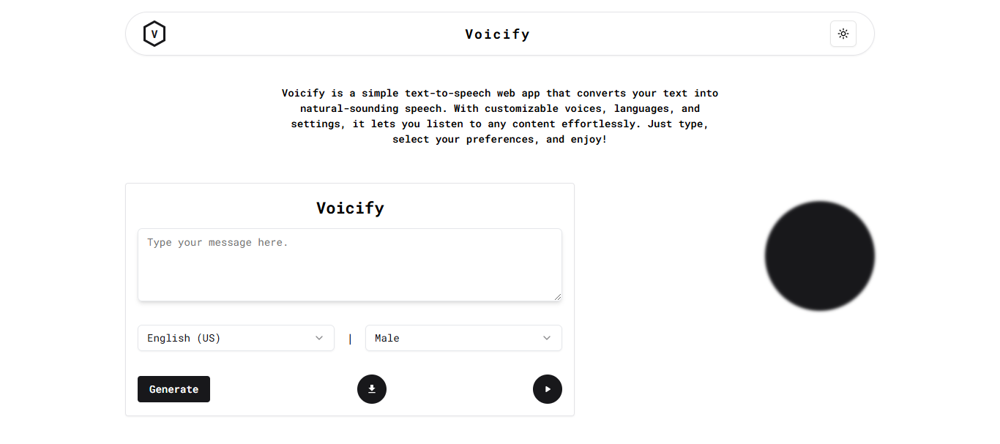

# Voicify - Text-to-Speech Web App



Voicify is a modern text-to-speech web application that allows users to convert written text into spoken words using VoiceRSS. Built with **Next.js**, it provides a fast and responsive UI for seamless user experience.

## 🚀 Features
- 🔊 Convert text to high-quality speech
- 🌐 Supports multiple languages & voices
- 🎵 Adjustable speech rate & pitch (if supported)
- 📂 Download generated speech as an audio file
- 🎨 Simple & intuitive UI with smooth animations

## 🎥 Live Demo
Check out the live version of Voicify here: **[Voicify Live](https://voiciify.vercel.app/)**

## 🛠️ Tech Stack
- **Next.js** – React framework for SSR & performance
- **TypeScript** – Strongly typed JavaScript
- **TailwindCSS** – Utility-first styling
- **VoiceRSS API** – Text-to-speech service
- **React Hooks** – For state management

## ⚡ Getting Started

### Prerequisites
Ensure you have **Node.js** installed (v16+ recommended).

### Installation
Clone the repository and install dependencies:

```bash
git clone https://github.com/yourusername/voicify.git
cd voicify
npm install.